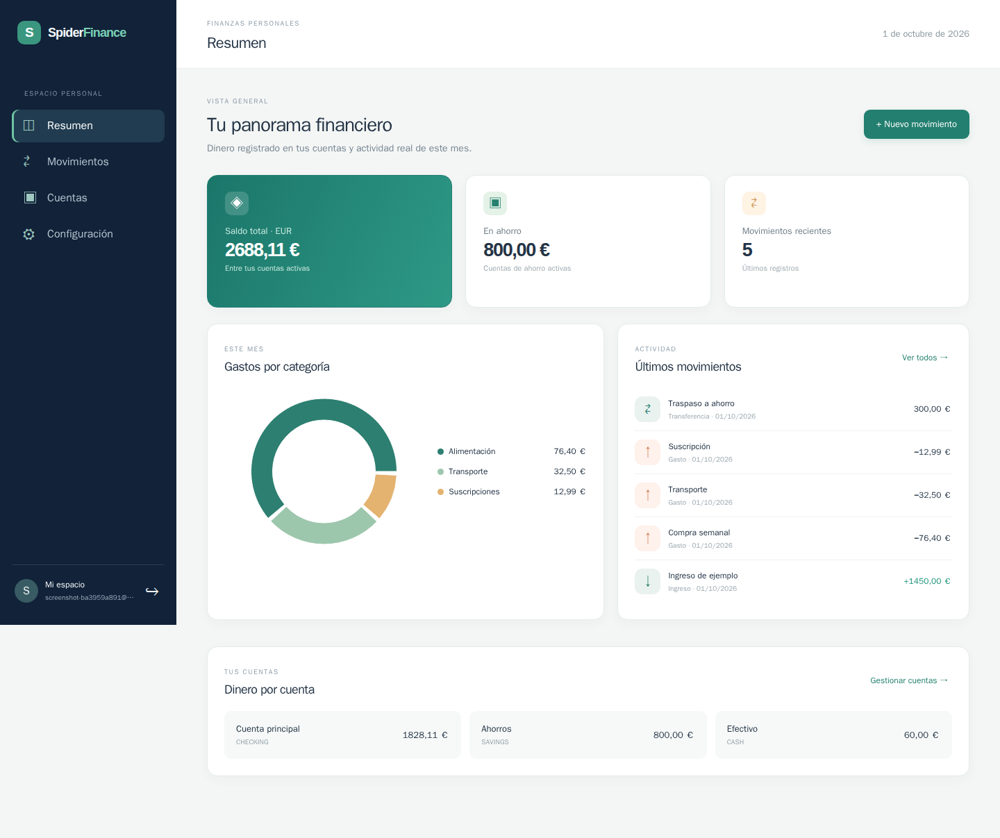
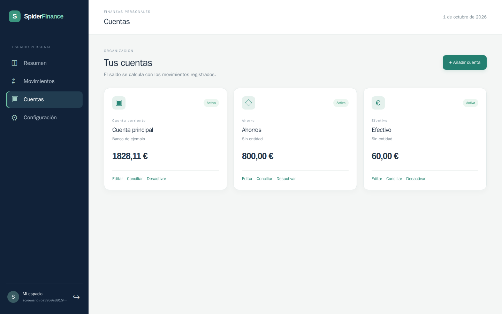
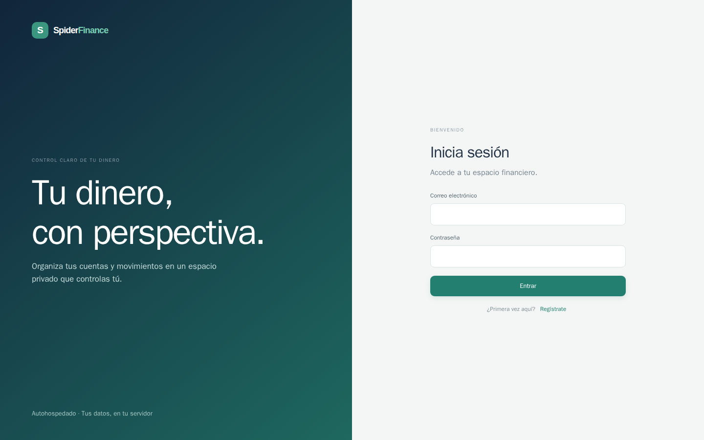

# SpiderFinance

Gestor de finanzas personales autohospedado. Permite registrar usuarios, cuentas, categorías y movimientos, planificar ingresos y pagos, y consultar una previsión de saldos. El diseño del sistema completo está en [ARCHITECTURE.md](ARCHITECTURE.md).

## Estado de la aplicación

Las ocho fases están implementadas. El resumen separa el saldo total del dinero disponible después de reservas; una transferencia reduce la cuenta de origen y aumenta la de destino sin cambiar el total. La previsión se identifica como tal y usa ingresos, obligaciones y movimientos pendientes. El ahorro usa reservas virtuales que reducen el disponible sin cambiar el saldo total. Presupuestos y estadísticas pueden consultarse por mes o ciclo de nómina. Inversiones y patrimonio se valoran manualmente por moneda. El simulador compara escenarios hipotéticos sin crear movimientos reales. La importación genérica CSV/XLSX/JSON está en la interfaz y la plantilla de finanzas personales tiene un importador completo por consola. Las transferencias no cuentan como gasto. Los movimientos pendientes o fechados en el futuro no alteran el saldo actual.

## Requisitos

- Docker Engine y Docker Compose.
- Puerto del equipo: `8080` por defecto para el frontend; configurable en `.env`.
- No se necesita ningún servicio externo para utilizarla.

## Instalación con Docker

```bash
cp .env.example .env
```

Edita `.env` con una contraseña de PostgreSQL y una clave `SECRET_KEY` aleatoria y larga. `APP_PORT` cambia el puerto del equipo si `8080` está ocupado; `APP_BIND_ADDRESS` controla desde qué interfaz se acepta la conexión. Después:

```bash
docker compose up -d --build
```

Abre `http://localhost:<APP_PORT>`, crea tu usuario y añade una cuenta. Con los valores de ejemplo la dirección es <http://localhost:8080>. PostgreSQL se guarda en el volumen `postgres_data`. El backend aplica migraciones Alembic al iniciar. La documentación de la API no se publica a través del frontend; en desarrollo está disponible en <http://localhost:8000/docs>.

El frontend contiene vistas de resumen, movimientos, cuentas, planificación, previsión, ahorro, presupuestos, inversiones, importación/exportación, simulador y configuración. Los formularios permiten registrar transferencias entre cuentas, ajustar saldos y crear subcategorías. En pantallas pequeñas la navegación pasa a la parte superior.

## Planificación y previsión

En «Planificación» puedes crear fuentes de ingreso mensuales, gastos recurrentes semanales o mensuales, gastos únicos y deudas con cuotas. Los vencimientos se muestran en un calendario de 90 días. Cuando registres el cobro o pago real en «Movimientos», vincúlalo al vencimiento: así se retira de los próximos pagos y el movimiento permanece como único efecto en el saldo. Los vínculos pueden corregirse sin borrar el movimiento.

«Previsión» proyecta los saldos durante 30, 90, 180 o 365 días. Incluye las obligaciones activas, los gastos recurrentes impagados del mes en curso y los movimientos pendientes o futuros. Se calcula al consultar, sin crear movimientos. Los importes de monedas distintas se muestran por separado. El ciclo de nómina requiere una fuente de ingreso marcada como principal; «primer día laborable» considera lunes a viernes, sin festivos nacionales.

## Ahorro

En «Ahorro» puedes crear objetivos con meta, moneda y prioridad; reservar dinero de una cuenta; aportar a un objetivo; y liberar reservas. Las aportaciones y liberaciones se conservan en un historial. Solo se puede reservar saldo disponible de una cuenta de la misma moneda, y una aportación no puede superar la meta pendiente. La previsión muestra el dinero reservado y lo descuenta del disponible.

Las reglas de ahorro calculan propuestas por porcentaje o cantidad fija de una fuente de ingreso. Distribuyen la propuesta entre objetivos activos por prioridad. La propuesta no crea una reserva automáticamente: regístrala como aportación cuando decidas asignar el dinero.

## Presupuestos y estadísticas

En «Presupuestos» puedes fijar límites por categoría o para todos los gastos, separados por moneda. Cada límite se aplica al mes natural o al ciclo de nómina actual; un límite de categoría padre incluye sus subcategorías. La pantalla muestra gasto confirmado, importe restante y desglose por categoría. Los movimientos pendientes y las transferencias no cuentan como gasto realizado. Para presupuestos por ciclo se necesita una fuente de ingreso principal.

## Inversiones y patrimonio

Crea una cuenta de tipo «Inversión», transfiere dinero a ella desde «Movimientos» y vincula la transferencia en «Inversiones». Puedes registrar posiciones con unidades, coste invertido y valor de mercado manual. El valor patrimonial de esa cuenta es el efectivo no asignado a posiciones más el valor actual de las posiciones; las aportaciones no se tratan como gasto. «Inversiones» muestra activos, deudas y patrimonio neto por moneda, y permite guardar un snapshot diario. No se convierten monedas ni se descargan precios de mercado.

## Importación y exportación

«Importar y exportar» acepta CSV UTF-8, XLSX y JSON de hasta 5 MB y 5000 filas. Detecta las columnas de un archivo exportado por SpiderFinance; también permite elegir hoja, corregir el mapeo, seleccionar una cuenta predeterminada y revisar errores y duplicados antes de confirmar. Los importes con signo pueden convertirse en ingresos o gastos; las transferencias requieren columnas de cuenta origen y destino. La confirmación crea las filas válidas en una sola transacción y omite las erróneas o ya importadas. Si corriges un archivo, vuelve a subirlo y revisa la nueva previsualización.

Puedes descargar tus movimientos en CSV, XLSX o JSON y volver a importarlos con el mismo esquema. La exportación identifica las cuentas por nombre y moneda (`Banco [EUR]`) y las subcategorías por ruta (`Hogar / Alquiler`), sin incluir IDs locales. Crea previamente las cuentas y categorías correspondientes en la instancia de destino; la previsualización señala referencias ausentes o ambiguas. Las cuentas con el mismo nombre y moneda deben distinguirse antes de importar. Los archivos antiguos con columnas de IDs siguen admitiéndose mediante mapeo manual, pero sus IDs solo son válidos en la instancia de origen. La exportación de movimientos no sustituye a una copia completa de la base de datos. El historial de archivos importados desde la interfaz puede borrarse sin borrar los movimientos; las claves de deduplicación se conservan.

La plantilla de finanzas personales, que contiene varias hojas relacionadas, se importa en un usuario recién registrado y sin datos financieros mediante un comando específico. El XLSX se lee desde el equipo y está ignorado por Git; no se incluye en la imagen Docker. Primero valida y después, con el ID del usuario, crea una copia de PostgreSQL y aplica toda la carga en una transacción:

```bash
./scripts/import-excel.sh 'Finanzas personales - Plantilla.xlsx' ID_USUARIO
./scripts/import-excel.sh 'Finanzas personales - Plantilla.xlsx' ID_USUARIO --apply
```

El importador crea cuentas, categorías y subcategorías, movimientos, presupuestos, gastos recurrentes y únicos, fuente de ingresos, objetivos, reservas y regla de ahorro. Comprueba que los saldos de las cuentas coinciden con el libro y rechaza una segunda carga sobre un usuario con datos. La cuenta «Ahorros» de la plantilla se conserva como separación contable virtual; la transferencia y las reservas reproducen el total y el disponible sin sumar dinero dos veces. El ajuste provisional de conciliación se identifica como ajuste, no como ingreso ordinario. Las hojas Dashboard, Plan ahorro, Resumen mensual y Patrimonio contienen cálculos o hipótesis: no generan movimientos reales.

## Simulador

En «Simulador» puedes añadir gastos o ingresos hipotéticos con fecha y cuenta, cambiar el importe de un suceso previsto o ponerlo a cero. También puedes reservar virtualmente un porcentaje de los ingresos planificados y consultar cuándo el saldo o disponible alcanza un objetivo. Compara el resultado diario con la previsión base durante 30, 90, 180 o 365 días y muestra la diferencia final por moneda. Puedes probar sin guardar o conservar varios escenarios para editarlos después. Guardar un escenario solo almacena su hipótesis: la comparación nunca crea movimientos ni modifica saldos reales. Si un suceso desaparece de la previsión o queda fuera del horizonte, se indica como ignorado.

## Capturas

Datos de ejemplo, sin información personal real:







## Configuración

| Variable | Uso |
| --- | --- |
| `POSTGRES_DB`, `POSTGRES_USER`, `POSTGRES_PASSWORD` | Base de datos local |
| `SECRET_KEY` | Firma de tokens JWT |
| `APP_BIND_ADDRESS` | Interfaz del equipo donde se publica el frontend; `127.0.0.1` por defecto |
| `APP_PORT` | Puerto del equipo para el frontend; `8080` por defecto |
| `REGISTRATION_ENABLED` | Permite crear cuentas nuevas; cambia a `false` después del alta inicial si vas a publicar la aplicación |
| `CORS_ORIGINS` | Orígenes permitidos para clientes externos de la API; el frontend integrado usa `/api` en el mismo origen |

El único puerto publicado por Compose es el del frontend. Los puertos `80`, `8000` y `5432` son internos a los contenedores y no necesitan cambiarse cuando otro servicio utiliza esos números en el equipo. Para acceder directamente desde la red local, usa una dirección del equipo en `APP_BIND_ADDRESS` o `0.0.0.0`; esta última escucha en todas las interfaces.

## Despliegue con Compose, Portainer o un proxy

El archivo `compose.yaml` contiene la pila completa. Con Docker Compose, las variables se toman de `.env`; en Portainer se introducen como variables de la pila o se cargan desde un archivo `.env`. En plataformas como Coolify, configura las mismas variables en el recurso. Mantén `POSTGRES_PASSWORD` y `SECRET_KEY` fuera del repositorio.

Si usas un proxy inverso, dirige el dominio HTTPS al servicio `frontend`, que escucha en el puerto interno `80`. No asignes dominio ni publiques puertos adicionales para `backend` o `postgres`. El navegador llama a `/api` en el mismo dominio y Nginx lo reenvía al backend por la red de Compose. El puerto `APP_PORT` sigue siendo configurable para el acceso directo al equipo; con `APP_BIND_ADDRESS=127.0.0.1` queda limitado a ese equipo.

Antes de habilitar el acceso desde Internet, crea la cuenta inicial, cambia `REGISTRATION_ENABLED=false` y recrea el backend con `docker compose up -d` (o vuelve a desplegar la pila en tu plataforma). La pantalla de acceso dejará de ofrecer el registro y la API rechazará nuevas altas. Si necesitas otra cuenta, habilita temporalmente el registro. Los datos permanecen en el volumen de PostgreSQL entre recreaciones.

Las preferencias de moneda principal, locale y zona horaria se editan por usuario en la aplicación. Cada cuenta conserva su propia moneda; las transferencias entre monedas distintas se rechazan hasta que exista una política de conversión.

## Actualización

El comando de actualización crea primero una copia de PostgreSQL en `backups/`, mantiene `.env` y el volumen de datos, y espera a que los servicios vuelvan a estar saludables. En Linux/macOS:

```bash
./scripts/update.sh local
```

En Windows PowerShell:

```powershell
.\scripts\update.ps1 -Mode local
```

`local` reconstruye los archivos ya presentes, sin reinstalar. En un clon Git, usa `source` para hacer `git pull --ff-only` antes de reconstruir:

```bash
./scripts/update.sh source
```

Para actualizar mediante imágenes publicadas en GHCR, añade `IMAGE_REPOSITORY=propietario/repositorio` a `.env` (en minúsculas). `APP_VERSION=latest` es opcional; puedes fijar `APP_VERSION=v1.2.3`. Arranca esa modalidad una vez con:

```bash
docker compose -f compose.yaml -f compose.release.yaml pull
docker compose -f compose.yaml -f compose.release.yaml up -d --no-build --wait
```

Después basta con `./scripts/update.sh release` (o `.\scripts\update.ps1 -Mode release` en Windows). El actualizador descarga las nuevas imágenes y recrea los contenedores; Alembic ejecuta las migraciones. Si GHCR es privado, inicia sesión con `docker login ghcr.io` antes de actualizar. `compose.release.yaml` requiere una versión reciente de Docker Compose con soporte para `!reset`.

## CI, etiquetas y releases

[GitHub Actions](.github/workflows/ci-release.yml) ejecuta pytest, las pruebas del versionado, la compilación de React y un arranque real con PostgreSQL antes de publicar. Tras cada push a la rama principal crea automáticamente una versión SemVer y, si todo pasa, publica las imágenes `ghcr.io/propietario/repositorio/backend:vX.Y.Z` y `.../frontend:vX.Y.Z` para amd64 y arm64. También actualiza `latest`, crea la etiqueta Git y un GitHub Release con `docker-images.json`, que contiene los digests inmutables. Un push manual de una etiqueta `vX.Y.Z` sigue el mismo control de pruebas y publica esa versión.

La primera versión es `v0.1.0`. Después, los commits `feat:` incrementan minor, `BREAKING CHANGE:` o `feat!:` incrementan major y los demás incrementan patch. Publica el proyecto en GitHub para activar el flujo; este directorio aún no tiene un remoto configurado. Las imágenes de GHCR pueden necesitar que se cambie su visibilidad a pública en GitHub Packages para permitir instalaciones anónimas.

## Copia y restauración

Para crear un archivo de copia SQL desde el directorio del proyecto:

```bash
docker compose exec -T postgres sh -c 'pg_dump -U "$POSTGRES_USER" "$POSTGRES_DB"' > spiderfinance-backup.sql
```

Para restaurarlo en una instalación nueva y vacía, arranca solo PostgreSQL y ejecuta:

```bash
docker compose up -d postgres
cat spiderfinance-backup.sql | docker compose exec -T postgres sh -c 'psql -U "$POSTGRES_USER" "$POSTGRES_DB"'
docker compose up -d
```

Guarda `.env` junto a tu copia en un lugar seguro; no se incluye en Git. La restauración de una copia sobre una base con datos existentes puede producir duplicados o conflictos.

Las copias creadas por el actualizador usan formato personalizado de `pg_dump` (`.dump`), adecuado para `pg_restore`. Guárdalas fuera del servidor periódicamente; `backups/` está excluido de Git.

## Desarrollo

Backend con Python 3.12 o superior:

```bash
cd backend
python -m venv .venv
. .venv/bin/activate
pip install -r requirements-dev.txt
alembic upgrade head
uvicorn app.main:app --reload
pytest
```

Por defecto usa SQLite local en desarrollo. Frontend con Node 22:

```bash
cd frontend
npm install
npm run dev
```

Vite atiende en <http://localhost:5173> y redirige `/api` a `localhost:8000`. La API publica OpenAPI en <http://localhost:8000/docs> durante desarrollo.

## Documentación

- [Arquitectura, modelo y roadmap](ARCHITECTURE.md)
- [Operación y respaldo](docs/operations.md)
